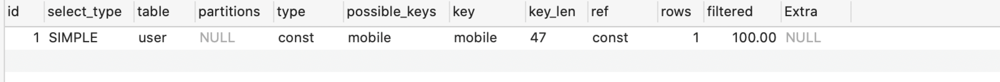

## mysql连接
```bash
mysql -h host -u user -p
descrlbe; desc;
load data txt插入数据
LOAD DATA LOCAL INFILE 'user.txt' INTO TABLE user;
quit 退出
```

# 基本操作
- like
- union连接两个select `select name from user union select name form teach` 重复的名字会去掉
- 排序 order by  `asc desc` 生序或者降序
- 分组 group by column 
-     with rollup 可以实现在分组统计数据基础上再进行相同的统计（sum,avg,count） 
-     coalesce 来设置一个可以取代null的名称
- join inner join   内连接     两个表中字断匹配关系
-       left join    左连接    左表所有记录
-       right join   右连接    右表所有记录
```
select u.mobile from user as u inner join teach as t on u.id = t.user_id;
```
-  null 使用 is null 或者 is not null 运算符  where id is not null 查询id为NULL的值不会显示出来

## create
```mysql
create database job; #创建数据库
use job; 
show tables;
create table user (
id int(10),
mobile varchar(16) default '' comment '手机号',
created datetime default null,
primary key ('id')) comment 'user表';
```
## select
```mysql
create table user (
    id int(10) not null primary key comment 'id',
    name varchar(30) default '' comment '名称'
);
select * from user;
select MAX(id) from user;
```

## regexp
- 正则匹配
```mysql
create table user (
    id int(10) not null primary key comment 'id',
    name varchar(30) default '' comment '名称'
);
select name from user where name regexp '^f';
#^ 字断以f开头的所有数据
#$ filed 以 'f$' f为结果的所有数据
#'f' filed 包含'f'字符串的所有数据
```

## insert
```mysql
create table user (
    id int(10) not null primary key comment 'id',
    mobile varchar(16) default '' comment '手机号',
    created_at datetime
);
insert into user (id,mobile,created_at)
values (1,'15903430044','2020-04-21 12:00:00');
```
## update
```mysql
create table user (
    id int(10) not null primary key comment 'id',
    mobile varchar(16) default '' comment '手机号'
);
update user set mobile='15900003333' where id=1;
```
## delete
```mysql
create table user (
    id int(10) not null primary key comment 'id',
    name varchar(30) default '' comment '名称'
);
delete from user where id=2;
```
## alter
```mysql
create table user (
    id int(10) not null primary key comment 'id',
    name varchar(30) default '' comment '名称'
);
alter table user add user_name varchar(32) default '' comment '名称';
alter table user drop user_name; #删除字断
alter table user modify user_name varchar(64);  ##modify修改类型不可修改字断名称
alter table user change user_name username varchar(32); ##change 可以修改名称
alter table user add primary key ('id'); #添加主键

```
## key
- 1.0主键 primary key 每个表只能定义一个主键，
- 1.1复合主键 primary key [filed,filed,filed]
- 1.2外键  foreign key `constraint user_dep_id foreign key(user_id) references user(id) `
- 父表定义的主键
>外键是表的一个字段，不是本表的主键，但对应另一个表的主键。定义外键后，不允许删除另一个表中具有关联关系的行。


```mysql
create table user (
    id int(10) not null primary key comment 'id',
    name varchar(30) default '' comment '名称'
);
create table user_dep (
    id int(10) not null primary key,
    user_id int(10) not null,
    created_at datetime,
    name varchar(32) default '',
    constraint user_dep_id foreign key(user_id) references user(id) 
);
```

- 1.3唯一索引 unique 要求该列唯一，允许为空，但只能出现一个空值
`constraint unique_name unique(mobile)`
## 事务
- mysql 事务只有数据库引擎为innodb才支持事务
- 事务用来管理insert,update,delete
- 满足事务的4个条件
- 1.原子性
- 2.一致性
- 3.隔离性
- 4.持久性
- set autocommit = 0禁止自动提交1开启自动提交
```mysql
create table user (
    id int(10) not null primary key comment 'id',
    name varchar(30) default '' comment '名称'
);
begin ;#开启事务
insert into user values (2,'15900008888','2020-4-03');
commit;#提交事务
rollback ;#回滚事务
```

## 索引
- 顺序访问-全表扫描
- 索引访问
>索引存储指定数据值的指针
- 1.0普通索引
- 1.1唯一性索引
- 1.2主键索引
- 1.3空间索引
- 1.4全文索引（varchar || text）
- 通常创建索引 `单列索引`  || `组合索引` 最左原则-index(a,b,c) where a=1,b=1,c=1 条件应该按照组合索引的顺序来写

## explain
```mysql
create table user (
    id int(10) not null primary key comment 'id',
    mobile varchar(16) default '' comment '手机号'
);
explain select * from user where mobile='15955559999';
```



- 11个字断
- 1.0 id 选择标识符
- 1.1 select_type 查询类型 
- 1.1.0 simple 简单select 不使用union或者子查询
- 1.1.1 primary 子查询中最外层查询，查询中若包含任何复杂的子部分
- 1.1.2 union union中第二个或后边的select
- 1.1.3 dependent union union中第二个或者后边的select，取决于外面的查询
- 1.1.4 union result union的结果， union语句中第二个select开始后面所有的select
- 1.1.5 subquery 子查询中第一个select
- 1.1.6 dependent subquery 子查询中的第一个select, 依赖于外部查询
- 1.1.7 derived 派生表的select,from子句的子查询
- 1.1.8 uncacheable subquery 子查询的结果不能被缓存，必须重新评估链接的第一行

- 1.2 table 表
- 1.3 type  访问类型

- 1.3.0 all 遍历全表
- 1.3.1 index 遍历索引树
- 1.3.2 range 只检索给定范围行，使用一个索引来选择
- 1.3.3 ref 连接匹配条件，
- 1.3.4 er_ref 使用primary key 或者 unique key 作为条件
- 1.3.5 const/system 
- 1.3.6 null 

- 1.4 possible_keys 查询字段若存在索引 则显示该索引，但不一定被查询使用
- 1.5 key 使用索引，必然包含在possible_keys 中
- 1.6 key_len 索引字段的最大可能长度并非实际长度
- 1.7 ref 列或常量被用于查找索引列上的值
- 1.8 rows 结果集行数
- 1.9 filtered 存储引擎返回的数据在server层过滤后，剩下多少满足查询的记录数量的比例
- 2.0 extra 额外的信息说明


## 锁
- 锁是协调计算机多个进程或多个线程访问某一资源的机制。保证数据并发访问的一致性，有效性
- 加锁是消耗资源的
###### 共享锁-读锁
- 其他事务不可写入，可读
###### 排他锁-写锁
- 其他事务不可读，不可写
###### -悲观锁-`假设会发生冲突`
- 每次拿数据都会认为别人会修改，每次拿都会上锁
###### -乐观锁-`假设不会发生冲突`
- 每次取数据都假设别人不会修改，不会上锁，只有在更新是会判断一下在此期间别人有没有更新这个数据

## 分区
- 将数据划分到多个位置存放
```mysql
SHOW VARIABLES LIKE '%partition%'; 
##have_partition_engine = yes
```

###### RANGE-range
**分区定义明确** 
`属于一个连续区间值的集合`

```mysql
create table user (id int(10) primary key ,name varchar(64)) comment 'user';
##对mobile range 分区
create table mobile(id int(10),user_id int(10) not null,mobile varchar(16))
partition by range(user_id) (
    partition p0 values less than (6),
    partition p1 values less than (11),
    partition p2 values less than maxvalue 
);
```

- maxvalue表示最大可能的整数值
- user_id 大于11 等于11 存到p2分区
- user_id 1-6之间存p0 6-11存到p1
###### LIST
`每个分区的定义和选择是基于某列的值从属于一个值列表集中的一个值`

```mysql
create table user (id int(10) primary key ,name varchar(64)) comment 'user';
##对mobile list 分区
create table mobile(id int(10),user_id int(10) not null,mobile varchar(16))
partition by list(user_id) (
    partition p0 values in (1,3,5,7,9,11),
    partition p1 values in (2,4,6,8,10)
);
```
###### HASH
- HASH分区中，MySQL 自动完成这些工作，你所要做的只是基于将要被哈希的列值指定一个列值或表达式，以及指定被分区的表将要被分割成的分区数量。
- 自定义表达式

```mysql
create table user (id int(10) primary key,name varchar(64));
create table mobile(id int(10),user_id int(10) not null )
partition by hash ( user_id )
partitions 4;
```

###### KEY
- MySQL簇（Cluster）使用函数MD5()来实现KEY分区；对于使用其他存储引擎的表，服务器使用其自己内部的 哈希函数，这些函数是基于与PASSWORD()一样的运算法则。

```mysql
create table user(id int(10) primary key,name varchar(64));
create table mobile(id int(10),user_id int(10) not null,mobile varchar(64))
partition by key (user_id)
partitions 4;

```

###### 子分区
- 子分区是分区表中每个分区的再次分割

- 分区合并 reorganize
```mysql
create table user (id int(10) primary key ,name varchar(64));
create table mobile(id int(10),user_id int(10) not null ,mobile varchar(64))
partition by list (user_id) (
    partition p0 values in (1,3,5),
    partition p1 values in (2,4,6)
);
alter table mobile reorganize partition p0,p1 into (
    partition p0 values in (1,2,3,4,5,6)
);
```

**注意事项**
- 1.做分区，不定义主键，要不分区字段加入主键
- 2.分区字段不能为null

## 分表
###### 目的-减轻数据库负担，缩短查询时间
###### 水平分表-横向
- 单表数据量大
- 1.根据id取摸%来插入表

###### 垂直分表-纵向
- 1.表的体积过大大于2G行数大于1000万
- 2.表中有text,blob,varchar(1000)


## source命令
```
use beego
source /www/beego.sql
```