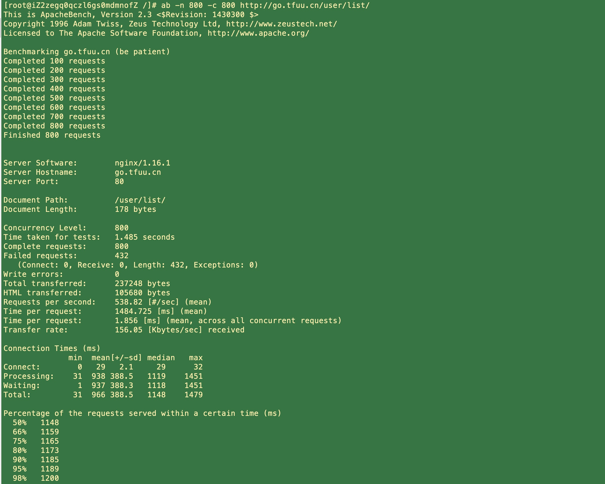

## 文件属性-文件操作
- `d 文件类型`
- `r-读-4` `w-写-2` `x-执行-1`

```
chown -R 777 文件名
ls: 列出目录
cd：切换目录
pwd：显示目前的目录
mkdir：创建一个新的目录
rmdir：删除一个空的目录
cp: 复制文件或目录
rm: 移除文件或目录
mv: 移动文件与目录，或修改文件与目录的名称
cat: 由第一行开始显示文件内容
tac: 文件从最后一行开始显示
nl: 显示行号 nl [-bn] 文件名  n ln rn zn b ba bt
more: 一页一页翻动
less: 一页一页翻动 q离开 pageup 向上翻动一页 pagedown 向下翻动一页 空白 向下翻动
head: 列出文件前面几行 head [-n number] 文件 
tail: 取出文件后面几行 tail [-n number] 文件  -f表示持续侦测 ctrl -c 停止

```
- 取 nginx.log 100 到 300 `cat nginx.log | head -n 300 | tail -n +100`
- 取 nginx.log 从100行开始 取300  `cat nginx.log | tail -n +100 | head -n 300`

## 进程操作


## 内存操作


## 磁盘操作
- `df` 列出文件系统的整体磁盘使用量

```bash
-a ：列出所有的文件系统，包括系统特有的 /proc 等文件系统；
-k ：以 KBytes 的容量显示各文件系统；
-m ：以 MBytes 的容量显示各文件系统；
-h ：以人们较易阅读的 GBytes, MBytes, KBytes 等格式自行显示；
-H ：以 M=1000K 取代 M=1024K 的进位方式；
-T ：显示文件系统类型, 连同该 partition 的 filesystem 名称 (例如 ext3) 也列出；
-i ：不用硬盘容量，而以 inode 的数量来显示
```

- `du` 检查磁盘空间使用量-命令是对文件和目录磁盘使用的空间的查看

- `fdisk` 用于磁盘分区操作工具
- `mkfs [-t 文件系统格式] 装置文件名` 格式化磁盘
- `fsck [-t 文件系统] [-ACay] 装置名称` 磁盘检验
- `mount 磁盘挂载` `umount卸载命令`


- 使用 `netstat -an | grep 端口`，查看端口是否已经被打开处于 Listening 状态

## ab 压测

```bash
ab -n 800 -c 800 http://go.tfuu.cn/user/list/
```



```
Complete requests 完成请求数
Failed requests 失败请求数
Requests per second 吞吐量-每秒请求数
```